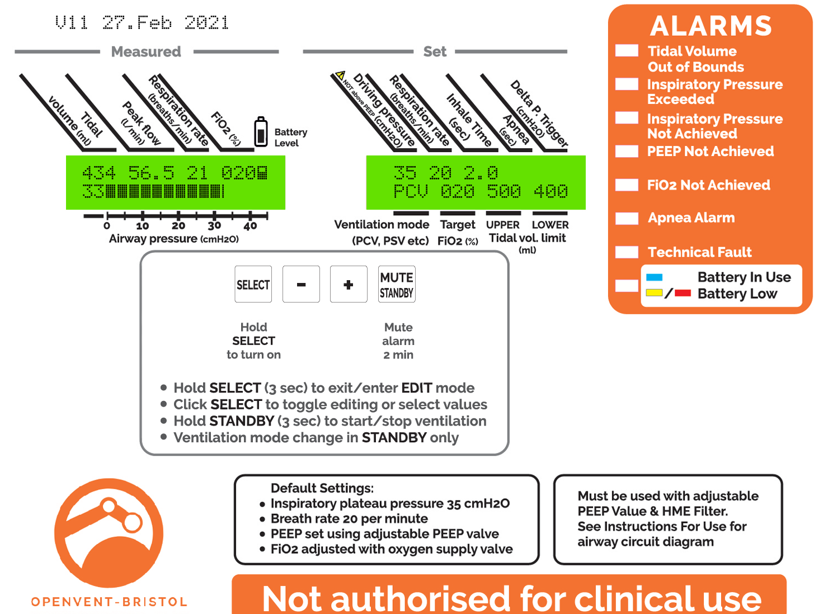

# UI_simulation
Processing sketch to simulate and develop the UI for our ventilator
Description of the UI and how it works can be found in following document under point 4.3
[Alarm_FPGA_requirements](https://docs.google.com/document/d/1dEHIGsteZMBpsoigabnPNWnhxVUWwxQ_PIZxRMofxKk/edit?usp=sharing)

PCV Mode:

PSV Mode:

# Installation
If you want to try to compile it yourselfe, you would need to:
1. download  and install Processing from processing.org
2. open processing install the Sound library using the manager found under: Sketch->Import Libraby...->Add library...
3. Press play, and it should work.

# Changelog
V1-V7 offline development to initial state on github.  
V8  
- added additional step to off mode to keep the interactions more consistent.
- new label
- added measured breath rate
- pressing 's' key creates screenshot  
V9  
- changed I:E ratio to iT
- added delta P Trigger
- moved upper tidal volume and apnea
- new label
V10  
- changed that the mode changes imediately on edit

  
